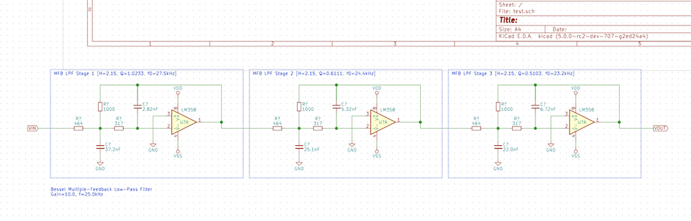
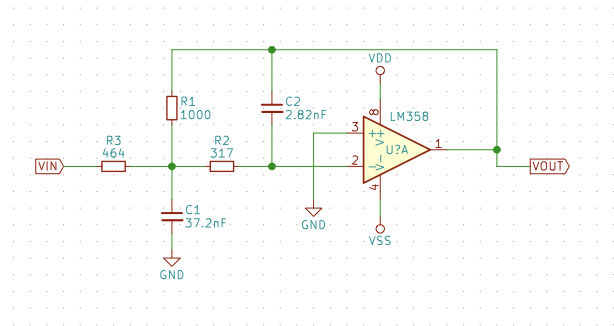

# KiCAD Schematic Filter Generator

This is a fairly simple filter generator that not only calculates
cascades but can also output KiCAD schematics.  I created this because
capturing and then populating components values in a schematic is
rather tedious - and error prone.

It currently only knows of Multiple-Feedback (MFB) low-pass filters.
These are sometimes referred to as Rauch filters in the literature.

It can generate a single-stage second order filter for an arbitrary
gain, corner frequency, and Q.

It can generate cascaded stages for Bessel and Butterworth filters.
(I will add Chebyshev at some point.)

It's run from the command line, and without any arguments produces a
usage message.
```
$ python ./rauch.py
usage:
  rauch.py butterworth f0 H0 N R1 [filename]
     N-stage Rauch/MFB low-pass filter calculator with Butterworth response.
     Calculates component values for a cut-off frequency (-3dB) of f0 Hz,
     gain H0.  R1 is used to scale resistors, with 1k being a good
     starting point.  If supplied, a KiCAD schmatic is output to 'filename'.

  rauch.py bessel f0 H0 N R1 [filename]
     N-stage Rauch/MFB low-pass filter calculator with Bessel response.
     Calculates component values for a cut-off frequency (-3dB) of f0 Hz,
     gain H0.  R1 is used to scale resistors, with 1k being a good
     starting point.  If supplied, a KiCAD schmatic is output to 'filename'.

  rauch.py stage f0 H0 Q R1 [filename]
     Single-stage Rauch/MFB low-pass filter calculator.
     Calculates component values for a cut-off frequency (-3dB) of f0 Hz,
     gain H0, and a given Q.  R1 is used to scale resistors, with 1k a good
     starting point.  If supplied, a KiCAD schmatic is output to 'filename'.

SI suffixes: M k  m u n p
```

At the bottom are the SI suffixes it's aware of. 

```
$ python ./rauch.py bessel 25k 10 3 1k ~/Desktop/filter.sch
Rauch LPF Stage (#1, Q=1.0233)
  R1: 1000ohm
  R2: 317ohm
  R3: 464ohm
  C1: 37.2nF
  C2: 2.82nF

Rauch LPF Stage (#2, Q=0.6111)
  R1: 1000ohm
  R2: 317ohm
  R3: 464ohm
  C1: 25.1nF
  C2: 5.32nF

Rauch LPF Stage (#3, Q=0.5103)
  R1: 1000ohm
  R2: 317ohm
  R3: 464ohm
  C1: 22.0nF
  C2: 6.72nF

Wrote schematic to /Users/bson/Desktop/filter.sch
$
```

The N parameter is the cascade length, NOT the filter order.  Each
stage is always second order, hence the filter order is always twice
that of N supplied.  It doesn't generate odd-order filters.  It also
doesn't know how to add passive stages as of now.

The filter generated can be added to KiCAD via File -> Append
Schematic Sheet...; the schematic has a token A4 page, with the filter
below it.  It's placed outside the page to make it easy to move it in
whole or pieces onto the sheet as desired.  The op amps will be LM358;
this is just a placeholder and is intended to be edited to suit.



If you don't want the stage boxes (line notes) or text notes, just remove them.
Feel free to cut it up and rearrange as needed, adding or renaming
labels as desired.

Note that when a schematic is appended in KiCAD all reference IDs are
reset, for this reason the filters are generated unannotated.  It
would just be confusing not to.  When stages are printed during
generation the components are named according to this reference stage:



The command line argument R1 is the value of R1 in the circuit above.
The resistors set the gain, so you can pick anything suitable for
this.  If in doubt, 1k is a fine value.  If the other resistors start
getting small, by all means step up to something bigger.

The code is mostly reasonably well factored, but some of it is overly
naive.  The offseting and relocation of subcircuits needs work.  It works
by building a tree representing the circuit and then outputting it as
a .SCH file.

# Note

The grid positions are snapped to 100mil.  This means if you use a
metric grid size you may run into alignment problems.  KiCAD
unfortunately can make these a pain to fix.  I'll add a grid
parameter at some point.

The rounding of numbers to N significant digits is buggy and currently
counts the decimal point as a digit.  I'll fix this also at some
point.
